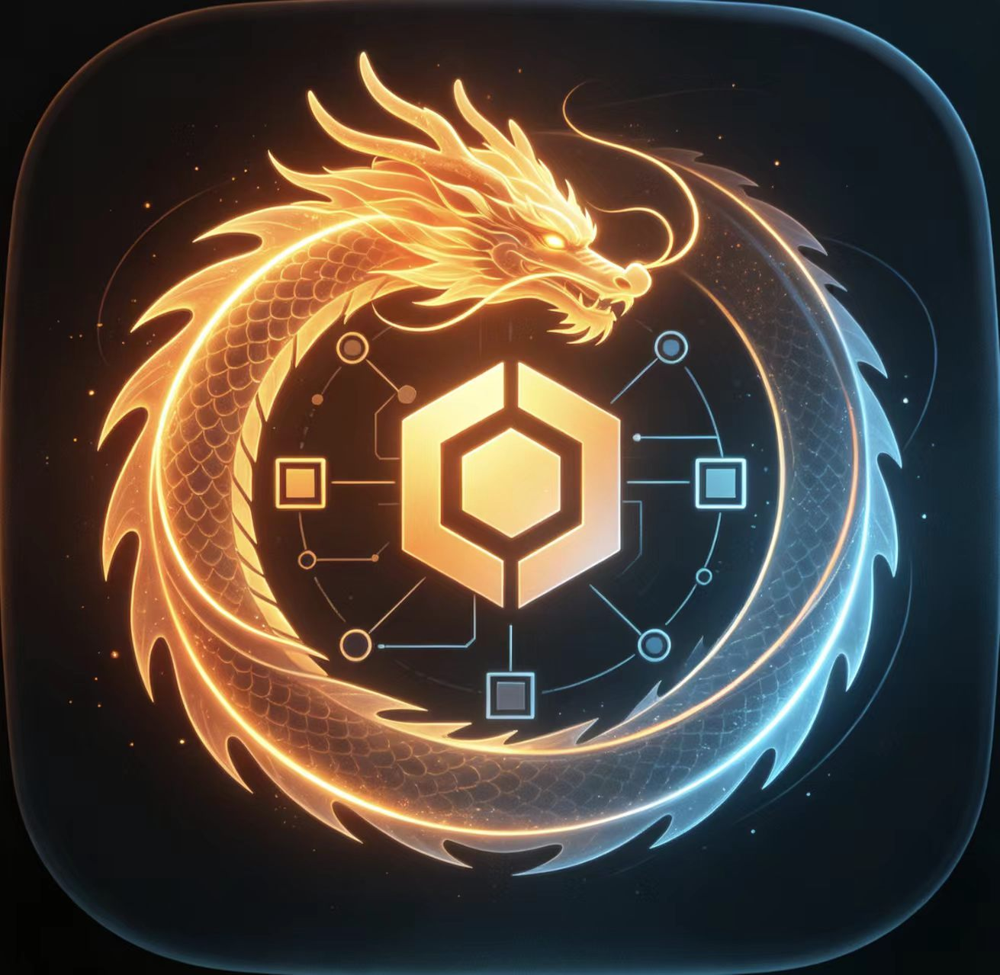

<p align="center">
  
</p>

<h1 align="center">烛龙 ZhuLong</h1>

<p align="center"><i>一台 Switch 模拟器，同时它的 GPU 层和引擎层本身就是一个游戏开发工具。</i></p>

<p align="center"><i>同一套代码，两个身份。</i></p>

---

## 这是什么

向下，它模拟一台游戏机：一份 guest 镜像进去，`内核/` 把 RAM、SSD、四核 Cortex-A57、Maxwell 3D
图形引擎、音频、挂载表、系统服务一件件摆出来，画面由 `gpu/` 渲染。

向上，同一套东西是一个游戏开发工具：`引擎/` 提供"场景即数据"的那一层，`编码器/` 是一个编辑器，
`宿主/` 里那几个程序是用这台机器写出来的游戏和工具。

**这两半不是拼在一起的，是同一件事的两面** —— 引擎的着色器本身就是 Maxwell 机器字，走的是和
guest 一样的解码路径。

```
                     ┌──────────────────────────────────────────┐
                     │  内核/system  System —— 那台"机器"        │
                     │  拥有下面的一切，并且驱动整个循环          │
                     └───────────────┬──────────────────────────┘
                                     │
              ┌──────────────────────┴──────────────────────┐
    ┌─────────▼─────────┐                        ┌──────────▼─────────┐
    │ 内核/ （内核那一半）│                        │ 引擎/ （引擎那一半） │
    ├───────────────────┤                        ├────────────────────┤
    │ RAM  内存 + MMU    │                        │ math   线性代数     │
    │ SSD  块设备        │                        │ mesh   程序化网格   │
    │ cpu  四核 A57      │                        │ scene  场景即数据   │
    │ gpu  Maxwell 3D    │                        │ renderer 画出 draws │
    │ audio 混音         │                        │ sound  声部         │
    │ mount 挂载表       │                        │ scene_file 场景文本 │
    │ service 内核/HLE   │                        └────────────────────┘
    └───────────────────┘
                                     │
              ┌──────────────────────┴──────────────────────┐
    ┌─────────▼──────────┐                       ┌──────────▼──────────┐
    │ 宿主/ （用机器的程序）│                       │ 编码器/（写程序的工具）│
    ├────────────────────┤                       ├─────────────────────┤
    │ render_scene        │                       │ 编辑器：树/标签/运行   │
    │ gugong    故宫       │                       │ 画面面板 + 键盘       │
    │ viewer    窗口       │                       │ 3D 建模器             │
    │ mix_scene 声音到文件  │                       │ cpp.py   编 C++（Zig）│
    │ xiangqi   象棋       │                       │ python 脚本运行       │
    │ modeler   建模器     │                       └─────────────────────┘
    └────────────────────┘
```

**一条规矩贯穿全部**：宿主不组装机器、不跑循环。宿主实现一个 `Platform`（窗口、声卡、输入），
把它交给 `System`，剩下的由机器驱动。

---

## 现在什么能用

**能做：**

* 从一份 guest 镜像跑起来 —— RAM / MMU / 四核 JIT / Maxwell 3D / 音频 / 挂载 / 服务都在
* **写一个 C++ 游戏**：描述一个场景，实现 `Platform`，交给 `System`。有象棋和故宫两个完整的例子
* **在编辑器里按 F5 跑**：`.py` 用解释器跑，`.cpp` 编出来再跑，画面出现在右边的面板里
* **3D 建模器**：挤出 / 细分 / 切角 / 删面 / 硬边 / 逐面材质与贴图 / 存读 `.model` / 导入 OBJ
* **打包**：`python 打包.py` 把整个项目装成一个能拷走的目录

**还不能，而且我们知道：**

| 缺口 | 在哪 |
|---|---|
| **没有测试** —— 两套都删掉了，验收只能靠人做 | [06-测试](文档/06-测试.md) |
| guest 异常入口没实现，中断到不了 guest（这个缺口是被**计数**的，不是被藏起来的） | `内核/service` |
| 阴影贴图在屋顶上有一道黑楔子，抬高 bias 无效 | `引擎` |
| 引擎读回帧缓冲是瓶颈：1024×640 只有 42fps | `引擎` |
| **建模器功能太少** —— 只有六个改网格的操作 | [计划书](开发报告/计划书.md) |
| 骨架 / 动画 / uv 编辑 / 多物体，一个字都没写 | [计划书](开发报告/计划书.md) |

**空缺我们都写下来了**，见 [计划书](开发报告/计划书.md) 的第二节 —— 不说清楚就是让人以为是自己错了。

---

## 五分钟

### 用

拿一份装好的 `发行/烛龙-<日期>/`，解压，**双击 `烛龙.exe`**。包里自带 Python、PySide6，和**一个
C++ 编译器**（Zig）—— 什么都不用装。**没有启动脚本**，那个 exe 就是全部。

### 从源码构建

需要：**CMake**、**Python 3.13 + PySide6**。想要随包发编译器的话还要一份
[Zig 0.13](https://ziglang.org) 解到 `运行环境/zig/`（MIT，可再分发）。

```bat
:: 1. 配置。那一串 =OFF 不能省：测试源文件已经不在树里，而开关还开着，配置就过不去。
cmake -S . -B build -G "Visual Studio 17 2022" -A x64 -DZL_BUILD_PYTHON_BINDINGS=ON ^
  -DZL_BUILD_CPU_TESTS=OFF -DZL_BUILD_RAM_TESTS=OFF -DZL_BUILD_SSD_TESTS=OFF ^
  -DZL_BUILD_GPU_TESTS=OFF -DZL_BUILD_AUDIO_TESTS=OFF -DZL_BUILD_MOUNT_TESTS=OFF ^
  -DZL_BUILD_SERVICE_TESTS=OFF -DZL_BUILD_SYSTEM_TESTS=OFF -DZL_BUILD_ENGINE_TESTS=OFF ^
  -DZL_BUILD_XIANGQI_TESTS=OFF
cmake --build build --config Release

:: 2. 开编辑器
python 编码器\main.py

:: 3. 出包（这一步会用包里的 Zig 把整个项目重编一遍）
python 打包.py
```

在编辑器里按 **F5** 就跑当前文件。想看象棋：打开 `宿主/xiangqi/main.cpp`，按 F5。

**一个程序不止一个文件。** 一个不属于任何已知目标的文件，按**文件夹**算一个程序 —— 它旁边的
`.cpp` 一起编。`宿主/xiangqi/main.cpp` 旁边有五个，所以它编得动。

---

## 目录

| | |
|---|---|
| `内核/` | 那台机器。八个子系统，每个一层，各有自己的 `include/zlong/<层>/` |
| `引擎/` | 场景、网格、数学、渲染器、声音。**场景是数据** |
| `宿主/` | 用这台机器写的程序 —— 窗口、故宫、象棋、建模器、渲染回归 |
| `编码器/` | 编辑器（PySide6）。一个 exe，一个依赖库 |
| `文档/` | 十一篇用法文档 + 一份从源码生成的签名参考 |
| `工具链/` | 两个编译垫片，让 Zig 编得动这个项目 |
| `external/` | 第三方：dynarmic（ARM64 JIT）、boost |
| `打包.py` | 把整个项目装成一个能拷走的目录 |
| `开发报告/计划书.md` | 以后要做的事。**现阶段都不做** |

**命名**：顶层目录用中文（给人看的），内部全 ASCII 小写；文件 `snake_case`，类型和函数
`PascalCase`，成员 `snake_case_`，常量 `kPascalCase`。细则在
[09-游戏开发范式](文档/09-游戏开发范式.md)。

---

## 两个编译器

| | 干什么 | 为什么 |
|---|---|---|
| **MSVC** | 开发时用，产出 `build/` | 编辑器要从它读 Vulkan 的路径和库名 |
| **Zig** | 随包发，也是编辑器编用户 C++ 用的那一个 | 微软的编译器**不允许随包再分发**，Zig 允许（MIT）。而 Zig 一个二进制里就有 clang 前端 + lld 链接器 + mingw-w64 的头和库 + libc++ |

版本**钉在 0.13**（clang 18）。0.16（clang 21）收紧了一条模板模板参数的匹配规则，`dynarmic` 自带
的 `mcl` 编不过 —— 试过，不是猜的。

---

## 文档

| 文档 | 讲什么 |
|---|---|
| [README](文档/README.md) | 总览和两台机器的形状 |
| [01-构建](文档/01-构建.md) | 两个编译器各干什么、开关、Python 绑定、常见错误 |
| [02-内核](文档/02-内核.md) | RAM / SSD / cpu / gpu / audio / mount / service |
| [03-引擎](文档/03-引擎.md) | 场景、渲染器、网格、数学、声音、场景文本格式 |
| [04-宿主](文档/04-宿主.md) | 五个宿主各自的用法，以及怎么自己写一个 |
| [05-编码器](文档/05-编码器.md) | 编辑器全功能 |
| [06-测试](文档/06-测试.md) | 现在没有测试：删掉了什么、要恢复怎么写 |
| [07-打包与发布](文档/07-打包与发布.md) | `打包.py` 装出什么、为什么这么装 |
| [08-从包里调组件](文档/08-从包里调组件.md) | **拿到包的人看这篇** |
| [09-游戏开发范式](文档/09-游戏开发范式.md) | **写游戏的人看这篇**：范式、命名、打包器遵守什么 |
| [10-3D建模器](文档/10-3D建模器.md) | 建模器全用法 |
| [参考/](文档/参考/) | 每一处公开声明的**签名**，从代码里取的，不会跟代码走散 |

---

## 第三方声明

**本项目使用了以下第三方的代码与成品，按各自的许可协议使用。版权归各自的作者所有。**

### 一、随源码仓库分发的

| 项目 | 许可 | 版权 | 用在哪 |
|---|---|---|---|
| [dynarmic](https://github.com/merryhime/dynarmic) | **0BSD** | Copyright (C) 2017 merryhime | ARM64 JIT —— `内核/cpu` 的核心 |
| [boost](https://www.boost.org/) | **BSL-1.0** | Copyright the Boost authors | dynarmic 的头文件依赖（只用头） |
| [xbyak](https://github.com/herumi/xbyak) | **BSD-3-Clause** | Copyright (c) 2007-2021 herumi | dynarmic 的 x86-64 汇编器（只用头） |
| [biscuit](https://github.com/lioncash/biscuit) | **MIT** | Copyright 2021 Lioncash | dynarmic 的位操作 |
| [catch2](https://github.com/catchorg/Catch2) | **MIT / BSL-1.0** | Copyright the Catch2 authors | dynarmic 的测试框架 |
| [{fmt}](https://github.com/fmtlib/fmt) | **MIT** | Copyright (c) 2012-present Victor Zverovich and {fmt} contributors | 格式化 |
| [mcl](https://github.com/merryhime/mcl) | **MIT** | Copyright (c) 2022 merryhime | 大整数与模运算 |
| [oaknut](https://github.com/merryhime/oaknut) | **MIT** | Copyright (c) 2022 merryhime | ARM64 汇编器 |
| [robin-map](https://github.com/Tessil/robin-map) | **MIT** | Copyright (c) 2017 Thibaut Goetghebuer-Planchon | 哈希表 |
| [Zycore](https://github.com/zyantific/zycore-c) | **MIT** | Copyright (c) 2018-2020 Florian Bernd | Zydis 的基础库 |
| [Zydis](https://github.com/zyantific/zydis) | **MIT** | Copyright (c) 2014-2021 Florian Bernd | x86 反汇编 |

### 二、随发行包分发的

| 项目 | 许可 | 用在哪 |
|---|---|---|
| [Zig](https://ziglang.org/) | **MIT** | `运行环境/zig/` —— 编译器 |
| [CPython](https://www.python.org/) | **PSF-2.0** | `运行环境/python/` —— 解释器 |
| [Qt / PySide6](https://www.qt.io/) | **LGPL-3.0** | `依赖库/` —— 编辑器界面（动态链接） |
| [shiboken6](https://doc.qt.io/qtforpython/) | **LGPL-3.0** | 同上，Qt 的 Python 绑定 |
| MSVC 运行库（`vcruntime140` 等） | 微软可再分发 | `依赖库/` |

**本项目自身的许可**：作者尚未指定。

## 状态

一份 2026-09-28 的快照：机器能从镜像跑起来，两个游戏能玩，编辑器能写能跑能打包，建模器能用但
功能少。**没有测试。** 验收靠人按 [07](文档/07-打包与发布.md) 那份清单做。

**这是一台一个人在写的模拟器** —— 这一点决定了它的节奏和它的缺口。缺口都在
[计划书](开发报告/计划书.md) 里摆着。
